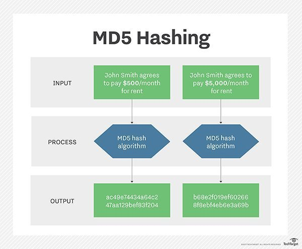

# MD5 message-digest algorithm - Report

## Introduction
The algorithm takes as input a message of arbitrary length and produces as output a 128-bit "fingerprint" or "message digest" of the input. The MD5 algorithm is designed to be quite fast on 32-bit machines. In addition, the MD5 algorithm does not require any large substitution tables; the algorithm can be coded quite compactly. MD5 is used for verifying files and transmissions, it should never be used for more as its very easy to break.

This repository contains the C code in the file md5.c aswell has a document used for testing test.txt, a folder of some of the labs that are extremely useful before attempting the project and finally a README and a overview report of the project.

### What the code does - Use of MD5
As explained in the introduction the MD5 algorithm takes an input of arbitrary length and produces as output a 128-bit "fingerprint" or "message digest" of the input. While the MD5 algorithm was originally designed for use as a secure hash algorithm for authenticating digitial signatures. MD5 has been deprecated for uses other than as a non-cryptographic checksum to verify data integrity and detect unintentional data corruption.

<br>

## Run

1. Install using these commands in command line on a linux machine

```
Run sudo apt-get update before running commands below
1. vim - sudo apt-get install vim
2. gcc - sudo apt install gcc
3. GIT - sudo apt-get install git
```

2. Clone the repo

```
git clone https://github.com/DarrenRegan/Theory-of-Algorithms-Project.git
```

3. cd Theory-of-Algorithms-Project and run commands
```
make md5
./md5 test.txt  //Runs MD5 Algorithm on text document
./md5 -t        //Runs a unit test for FGHI
./md5 -h        //Runs help command which gives instructions on commands and how to run app
./md5 -v        //Displays current versions of software installations
```

## Tests
To run the unit test all you need to do is run the ./md5 -t provided in the Run section.
This will run a unit test on Step 4. of the Algorithm which processes messages in 16-Word Blocks

This test will test the F, G, H, I functions with the logic below
```
F(X,Y,Z) = XY v not(X) Z 
G(X,Y,Z) = XZ v Y not(Z)
H(X,Y,Z) = X xor Y xor Z
I(X,Y,Z) = Y xor (X v not(Z))
```
## Algorithm
Here are the Five Steps that are used to complete the MD5 Algorithm
##### Step 1. Append Padding Bits
The message is "padded" (extended) so that its length (in bits) is
congruent to 448, modulo 512. That is, the message is extended so
that it is just 64 bits shy of being a multiple of 512 bits long.
Padding is always performed, even if the length of the message is
already congruent to 448, modulo 512.

Padding is performed as follows: a single "1" bit is appended to the
message, and then "0" bits are appended so that the length in bits of
the padded message becomes congruent to 448, modulo 512. In all, at
least one bit and at most 512 bits are appended.


##### Step 2. Append Length
 A 64-bit representation of b (the length of the message before the
 padding bits were added) is appended to the result of the previous
 step. In the unlikely event that b is greater than 2^64, then only
 the low-order 64 bits of b are used. (These bits are appended as two
 32-bit words and appended low-order word first in accordance with the
 previous conventions.)

 At this point the resulting message (after padding with bits and with
 b) has a length that is an exact multiple of 512 bits. Equivalently,
 this message has a length that is an exact multiple of 16 (32-bit)
 words. Let M[0 ... N-1] denote the words of the resulting message,
 where N is a multiple of 16.

##### Step 3. Initialize MD Buffer
 A four-word buffer (A,B,C,D) is used to compute the message digest.
 Here each of A, B, C, D is a 32-bit register. These registers are
 initialized to the following values in hexadecimal, low-order bytes
 first):
```
word A: 01 23 45 67
word B: 89 ab cd ef
word C: fe dc ba 98
word D: 76 54 32 10
```
##### Step 4. Process Message in 16-Word Blocks
Define four auxiliary functions that each take as input three 32-bit words and produce as output one 32-bit word.
```
F(X,Y,Z) = XY v not(X) Z
G(X,Y,Z) = XZ v Y not(Z)
H(X,Y,Z) = X xor Y xor Z
I(X,Y,Z) = Y xor (X v not(Z))

// FGHI - Process Message in 16-Word Blocks - Section 3.4
uint32_t F(uint32_t x, uint32_t y, uint32_t z){
	return (x & y) | ((~x) & z);
}
uint32_t G(uint32_t x, uint32_t y, uint32_t z){
	return (x & z) | (y & (~z));
}
uint32_t H(uint32_t x, uint32_t y, uint32_t z){
	return x ^ y ^ z;
}
uint32_t I(uint32_t x, uint32_t y, uint32_t z){
	return y ^ (x | (~z));
}
```
In each bit position F acts as a conditional: if X then Y else Z.
The function F could have been defined using + instead of v since XY
and not(X)Z will never have 1's in the same bit position.) It is
interesting to note that if the bits of X, Y, and Z are independent
and unbiased, the each bit of F(X,Y,Z) will be independent and
unbiased.

The functions G, H and I are similar to the function F, in that they act in "bitwise parallel" to produce their output from the bits of X, Y, and Z in such a manner that if the corresponding bits of X, Y, and Z are independent and unbiased, then each bit of G(X,Y,Z), H(X,Y,Z), and I(X,Y,Z) will be independent and unbiased.

##### Step 5. Output
The message digest produced as output is A, B, C, D. That is, we 
begin with the low-order byte of A, and end with the high-order byte
of D.

## Complexity
The MD5 message-digest algorithm is simple to implement, and provides a "fingerprint" or message digest of a message of arbitrary length. It is conjectured that the difficulty of coming up with two messages having the same message digest is on the order of 2^64 operations, and that the difficulty of coming up with any message having a given message digest is on the order of 2^128 operations.

## References

* [The MD5 Message-Digest Algorithm](https://tools.ietf.org/html/rfc1321) - This is a document from MIT that describes the MD5 message-digest algorithm. It was by far the most useful reference for this project, it very clearly lays out the steps of the algorithm and how it works. I recommened reading this document to gain a good understanding of the MD5 Algorithm
* [MD5 Wikipedia](https://en.wikipedia.org/wiki/MD5) - provides good information on what the MD5 Algorithm is, what it's used for and the history around it. There is also sections on the vulnerabilities of the algorithm and links to other implementations of such algorithm.
* [Video - Hashing Algorithms and Security](https://www.youtube.com/watch?v=b4b8ktEV4Bg) - Excellent video on Hashing Algorithms and Security, the video is well worth watching. The video will give you a good idea of the use of Hashing Algorithms if you we're unsure on exactly what they do.
* [Video - SHA: Secure Hashing Algorithm](https://www.youtube.com/watch?v=DMtFhACPnTY) - Explains Hash Functions and SHA, talks about hash functions for cryptography that are used for message authentication and digital signatures. Explains that MD5 is made to be slow because of it's uses, but these hash functions need to be quick to verify and compute.
* [Fast Collision Attack on MD5](http://crppit.epfl.ch/documentation/Hash_Function/Examples/Code_Project/Documentation/104.pdf) - Paper on finding collisons in MD5 Algorithm, results showed that they were able to find full MD5 collisions in only minutes on a 3Ghz Pentium4.

